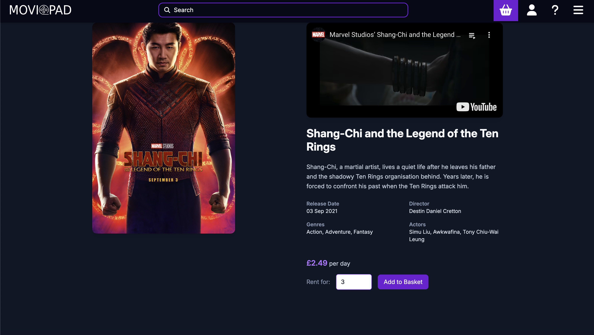
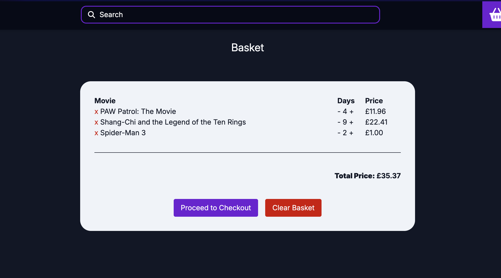
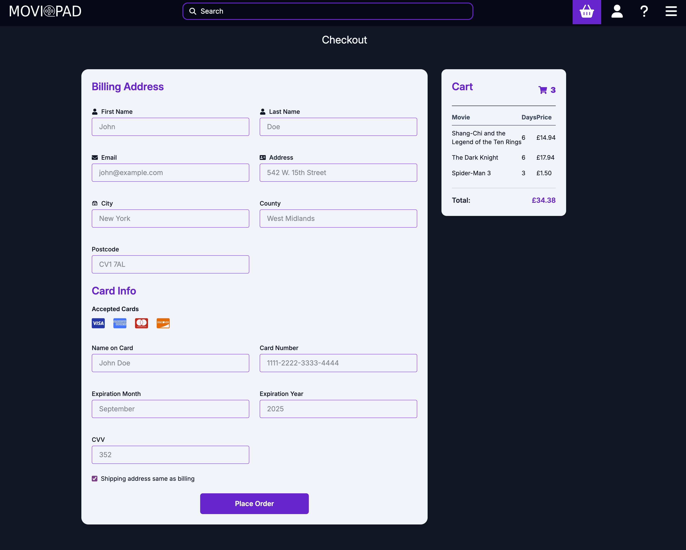

# MoviePad Demo Website

This project was first developed in my second year of university for my Human Behaviour in Cyber Security module.

It was a group project where we had to create a website that would allow users to rent movies. The website was developed
using React and Tailwind for the frontend. The website is designed to be a simple movie rental service, where users can
browse movies, add them to their cart, and checkout. The website also has a user authentication system, allowing users
to create accounts and log in.

## Frontend design

The frontend is designed to be simple and easy to use. The main page displays a grid of movies, with each movie showing
its title, image, and a button to add it to the cart. The user can click on a movie to view its details, including a
description and a button to add it to the cart. The cart page displays the movies that the user has added to their cart,
with a button to proceed to checkout. The checkout page allows the user to enter their payment details and complete the
rental process.

## Backend design

The backend is design using microservices architecture, with a separate service for the movies and another for the
users. The movies service is designed using FastAPI, which allows for quick and efficient development of RESTful APIs.
The users service is designed using Node.js and Express, which provides a simple and flexible way to handle user
authentication and management. The backend uses MongoDB as the database for movie data. The database of choice for user
data is PostgreSQL, which provides a robust and reliable way to store user information.

## Tech Stack

- frontend: HTML, React, TailwindCSS, react-router, redux, Shadcn UI, Sonner
- backend: Node.js, Express, FastAPI
- user database: PostgreSQL
- movie database: MongoDB
- authentication: JWT
- deployment: Docker, Docker Compose

## Getting Started

- To deploy the docker container: `docker-compose up --build`

## Gallery

Main Page: 

Movie Page: 

Basket Page: 

Checkout Page: 

## License

This project is licensed under the MIT License - see the [LICENSE](./LICENSE) file for details.

## Contributing

If you want to contribute to this project, feel free to open an issue or a pull request. Contributions are welcome!
